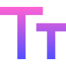
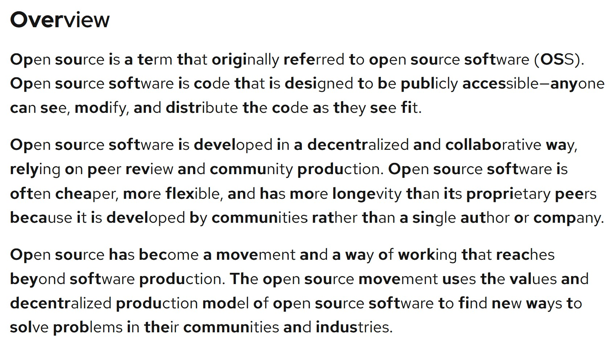

# BiReader **·** [Firefox Addon](https://addons.mozilla.org/en-US/firefox/addon/bireader/) **·** [Chrome Extension](https://chrome.google.com/webstore/detail/bireader/mkndieaclikppobgjihfijainfmjcbhd)

This is a WebExtension (Firefox AND Chrome) based off of the principles of Bionic Reader to improve speed and depth of reading web text! Unfortunately, the B\*onic Reader company are very strict with their tRaDeMaRk :unamused: so I have made my own version which is NOT the same concept and is instead an innovation of the idea.

BiReader allows for users to enable easier reading on ANY website (see below for an example on the Open Source Redhat article). Simply click the button and transform almost all the text on your pages with the new BiReader format! Emphasizing the starts of words, BiReader helps you read faster and easier than ever before!

Some websites admittedly don't work too well with this extension, but (if the site has accessibility support) you should be able to see the bolded text in the reader view as well.

To promote open source development, I have included the [WTFPL License](http://www.wtfpl.net/). Feel free to do whatever you want with my code, or simply help by making a suggestion or pointing out issues - I'm open to any suggestions :D

## Example of BiReader from [Redhat](https://www.redhat.com/en/topics/open-source/what-is-open-source?pfe-kpvsezlql=related-articles)

## Development

First, run `yarn install` to install the dependencies.

To test on Chrome, run `yarn dev:chromium`; to test on Firefox, run `yarn dev:ff`. To build for the extension store, run `yarn package:chromium` or `yarn package:ff`.

## Future Plans

This is currently a **_very rough version_** of the extension, and I would love for feedback (just make an Issue or email me at michaelzhao314@gmail.com). Here are some things I plan on implementing in the future:

- Create a consolidated Firefox/Chrome version when Firefox DECIDES TO UPDATE TO MANIFEST VERSION 3
- And more (based on suggestions)!
